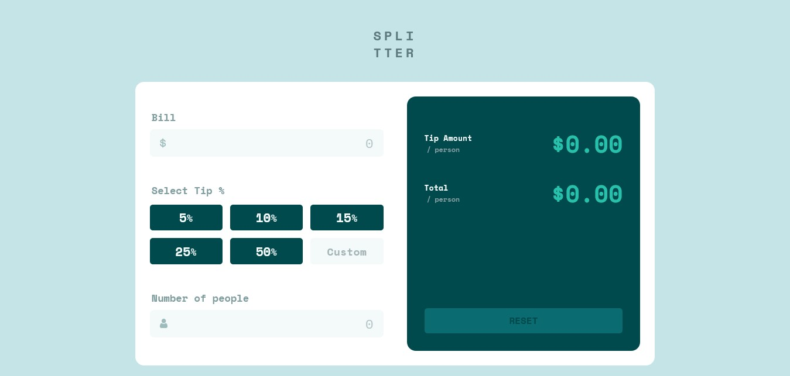

## Splitter (Tip Calculator)

# Project Reference - Frontend Mentor - Tip calculator

## Overview

The Splitter tip calculator's functionality is modelled on equal tip distribution among a group
of tip-eligible people/staffs/workers/employees. The Splitter calculates by splitting the total aggregate collection of money/bill at specific X percents for N number of person.

```To calculate tip per person,using this formulae:
tip = bill * X/100N
```

```To calculate the paid amount per person,using this formulae:
Amount = bill * (1/N + X/100N)
```
### The challenge

Users should be able to:

- View the optimal layout for the app depending on their device's screen size
- Calculate the correct tip and total cost of the bill per person

### Screenshot



### Link

- Live Site URL: [Splitter](https://tip-calculator-gamma-blush.vercel.app/)

## My process

I break the entire webpage into small component views/UIs and leverage on the concept of
SEPARATION OF CONCERNS in which each component manages its own logic, data and aesthetic codes.

Splitter UI is broken into the following components:

- Button
- InputBox
- Display

I made Button and InputBox components **generic or reusable** components because they are the
major building blocks for the entire webpage.

### Built with

- Semantic HTML5 markup
- CSS custom properties
- Flexbox
- CSS Grid
- Mobile-first workflow
- [React](https://reactjs.org/) - JS library
